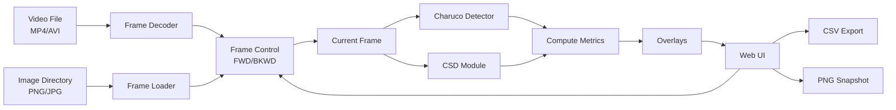

# Camera Shift Detector — Test Modes A/B/C Tech Spec

## 1) Objective

Three test modes for camera-shift debugging. All modes run computations live on current frame. Manual frame stepping (FWD/BKWD). No offline result reading.

## 2) Scope

* In scope: live computation, display, metrics, CSV/PNG export, keyboard controls.
* Out of scope: offline result files, model training, SCADA, alerting, cloud.

## 3) Modes

### Mode A — Side-by-side Charuco vs CSD

Validation tool. Run both Charuco and CSD on baseline and current frame, compare results live.

* Inputs: image frames (video or directory).
* Process:
  * Execute Charuco detector on baseline and current frame.
  * Execute CSD detector on baseline and current frame.
  * Compute displacement: Charuco(baseline → current) and CSD(baseline → current).
  * Compute difference: Δ_displacement = CSD_displacement - Charuco_displacement.
* Display: 4-image layout:
  * Top-left: Baseline with Charuco symbols/corners detected
  * Top-right: Baseline with ORB features detected (CSD)
  * Bottom-left: Current frame with Charuco symbols/corners detected
  * Bottom-right: Current frame with ORB features detected (CSD)
  * Metrics panel: Charuco displacement (dx_c, dy_c), CSD displacement (dx_s, dy_s), Difference (Δdx, Δdy)
* Controls: FWD/BKWD to step frames, compute on demand.

### Mode B — Baseline + CSD correspondences

Pick baseline frame, step through sequence. Run CSD against baseline, show matches live.

* Inputs: image frames, or directory, or video sequence
* Process: User pins baseline for non-video input, CSD computes matches/transform for current frame vs baseline.
* Display: motion vectors, inliers/outliers, residual RMSE, diff heatmap.
* Controls: FWD/BKWD, baseline pin, amplify diff.

### Mode C — Alpha blend A/B

Visual alignment check. Select two frames, compute transform, blend.

* Inputs: any two frames, or a list of images paths A and B.
* Process: CSD computes transform between selected frames on demand.
* Display: alpha blend, optional pre-warp using computed transform.
* Controls: frame selectors, alpha slider, blink toggle, pre-warp toggle.

## 4) Architecture



### Components

* UI: Single HTML file + vanilla JS.
* Video File: MP4/AVI input, decoded to frames on-demand.
* Image Directory: PNG/JPG files loaded as frame sequence.
* Frame Decoder: Extract frames from video (FFmpeg or HTML5 video element).
* Frame Loader: Index image files by frame_id/filename.
* Frame Control: Step FWD/BKWD, manage current/baseline, cache frames.
* Charuco Detector: Execute Charuco on frame, return detected symbols/corners.
* CSD Module: Execute ORB feature detection and matching on frame(s).
* Metrics: Compute displacements (dx, dy), displacement differences (Δdx, Δdy), RMSE, inlier ratio.
* Overlays: Draw Charuco symbols/corners and ORB features on canvas, 4-image layout for Mode A.
* Export: CSV metrics, PNG snapshots.

## 5) Data Flow

### Mode A Flow

1. User steps to frame N (FWD/BKWD).
2. UI calls Charuco detector on baseline frame 0 → detect symbols/corners.
3. UI calls Charuco detector on current frame N → detect symbols/corners.
4. Compute Charuco displacement: (dx_c, dy_c) = Charuco(frame_0 → frame_N).
5. UI calls CSD detector on baseline frame 0 → detect ORB features.
6. UI calls CSD detector on current frame N → detect ORB features.
7. Compute CSD displacement: (dx_s, dy_s) = CSD(frame_0 → frame_N).
8. Compute displacement difference: (Δdx, Δdy) = (dx_s - dx_c, dy_s - dy_c).
9. Draw 4-image layout with overlays:
   * Baseline Charuco (symbols/corners)
   * Baseline CSD (ORB features)
   * Current Charuco (symbols/corners)
   * Current CSD (ORB features)
10. Display metrics panel with all displacement values and differences.

### Mode B Flow

1. User pins baseline frame B.
2. User steps to frame N (FWD/BKWD).
3. UI calls CSD(baseline=B, current=N) → get matches, transform, inliers.
4. Draw motion vectors, compute RMSE, show diff heatmap.

### Mode C Flow

1. User selects frame A and frame B.
2. UI calls CSD(A, B) → get transform.
3. Optional: pre-warp B using transform.
4. Alpha blend A and B, display.
5. Blink toggle for quick comparison.

## 6) Result Schema

Live computation returns per-frame result:

```json
{
  "frame_id": "000123",
  "transform": { "dx": 1.2, "dy": -0.7 },
  "quality": { "inliers": 142, "total": 210, "rmse": 1.9 }
}
```

Optional correspondences:

```json
{
  "matches": [
    {"x0": 512.3, "y0": 301.8, "x1": 517.1, "y1": 305.6, "inlier": true}
  ]
}
```

## 7) Overlays

* Mode A - Charuco images: detected Charuco symbols and corners marked with crosses/circles.
* Mode A - CSD images: detected ORB features marked as colored circles.
* Mode B: motion vectors as arrows, inliers (green), outliers (red), diff heatmap.
* Mode C: pre-warp grid overlay for alignment visualization.

## 8) Metrics

Per frame:

* Mode A:
  * Charuco displacement: (dx_c, dy_c) from baseline
  * CSD displacement: (dx_s, dy_s) from baseline
  * Displacement difference: (Δdx, Δdy) = (dx_s - dx_c, dy_s - dy_c)
  * Displacement error magnitude: √(Δdx² + Δdy²)
* Mode B:
  * Inlier ratio, RMSE

Aggregates (across stepped frames):

* Mean/Std of Δdx, Δdy
* Mean/Std of displacement error magnitude
* Stability score: fraction with √(Δdx² + Δdy²) < τp

CSV export columns:

```csv
frame_id, dx_charuco, dy_charuco, dx_csd, dy_csd, delta_dx, delta_dy, error_mag, inliers, total, rmse
```

## 9) Controls

* Global: `←/→` or FWD/BKWD step frames, `1/2/3` switch modes, `B` blink, `R` toggle ROI.
* Mode A: "Run Both" button, swap views.
* Mode B: "Pin Baseline" button, amplify diff slider.
* Mode C: frame A/B selectors, alpha slider, "Pre-warp" toggle.

## 10) Module Integration

### Python Backend (FastAPI)

Endpoints execute modules on demand:

```
POST /charuco/detect
  body: { "frame_path": "..." }
  returns: {
    "symbols": [...],  # detected Charuco symbols
    "corners": [...],  # detected corners with (x, y) coordinates
    "ids": [...]       # Charuco marker IDs
  }

POST /charuco/displacement
  body: { "baseline_path": "...", "current_path": "..." }
  returns: { "dx": 1.2, "dy": -0.7 }

POST /csd/detect
  body: { "frame_path": "..." }
  returns: {
    "features": [{"x": 512.3, "y": 301.8, "size": 5.2}, ...]  # ORB keypoints
  }

POST /csd/match
  body: { "baseline_path": "...", "current_path": "..." }
  returns: {
    "dx": 1.5, "dy": -0.9,
    "matches": [{"x0": 512.3, "y0": 301.8, "x1": 517.1, "y1": 305.6, "inlier": true}, ...],
    "quality": {"inliers": 142, "total": 210, "rmse": 1.9}
  }
```

### In-browser (WebAssembly)

Alternative: compile OpenCV/aruco to WASM, run client-side. Skip backend.

## 11) Implementation Plan

1. **Frame loader**:
   * Image directory: index PNG/JPG files
   * Video: decode MP4/AVI using HTML5 video element or FFmpeg
2. **Backend stubs**: mock `/charuco/detect` and `/csd/match` with synthetic data.
3. **UI frame stepping**: FWD/BKWD logic, current frame display, frame caching.
4. **Mode A**:
   * 4-canvas layout (2x2 grid)
   * Call Charuco detector on baseline and current → draw detected symbols/corners
   * Call CSD detector on baseline and current → draw detected ORB features
   * Compute both displacements and their difference
   * Display metrics panel
5. **Mode B**: baseline pin, call CSD endpoint, draw motion vectors/diff.
6. **Mode C**: frame selectors, call CSD, alpha blend with optional pre-warp.
7. **Replace stubs**: wire real Charuco and CSD modules.

## 12) Testing

* Synthetic data: 10 frames with known rigid shifts (dx, dy only).
* Mode A: verify Charuco and CSD displacements match ground truth, verify displacement differences (Δdx, Δdy).
* Mode B: verify inlier count and RMSE.
* Mode C: verify alpha blend and pre-warp rendering.

## 13) Acceptance Criteria

* Load 10-200 frames, step FWD/BKWD smoothly.
* Mode A: 4-image layout displays (baseline Charuco, baseline CSD, current Charuco, current CSD) with detected features, displacement metrics computed and displayed.
* Mode B: baseline pins, CSD runs on frame vs baseline, vectors display.
* Mode C: select frames, transform computed, blend works, blink toggles.
* Export CSV with metrics, PNG snapshots.

## 14) Work Breakdown

* Frame control + stepping: 0.5 d.
* Backend stubs + endpoints: 0.5 d.
* Mode A (4-image layout + displacement computation): 1.5 d.
* Mode B (baseline + vectors): 1 d.
* Mode C (blend + warp): 0.5 d.
* Overlays (Charuco symbols/corners + ORB features): 1 d.
* Metrics computation + display: 0.5 d.
* CSV export: 0.5 d.
* Wire real modules: 1 d.

Total: ~6-7 days.

## 15) YAGNI

* No offline JSONL loading. Run live only.
* No database, auth, packaging, build pipeline.
* No 3D unless Charuco requires it immediately.
* No styling. Function first.

---

**Decision**: Implement frame stepping and live module execution. Stub backends first, replace with real Charuco/CSD later.
