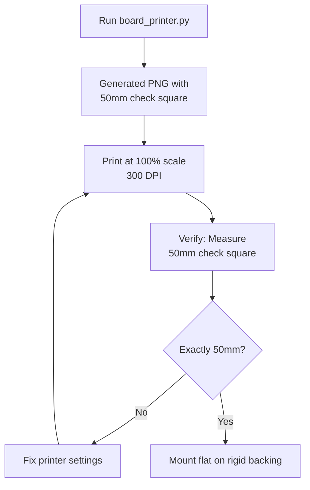
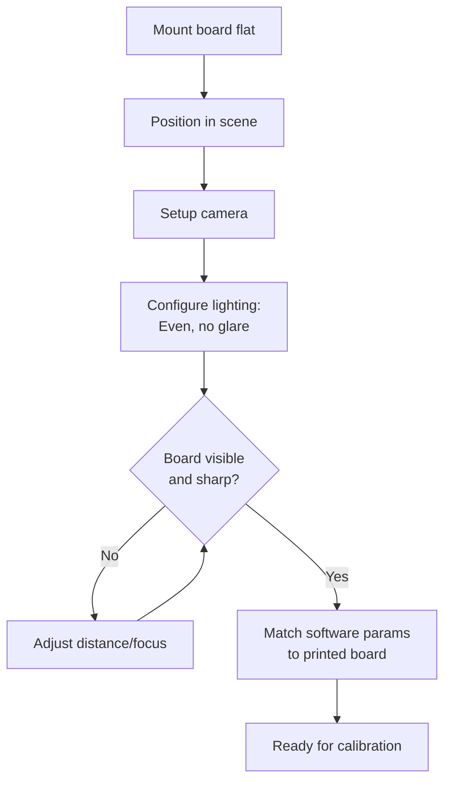
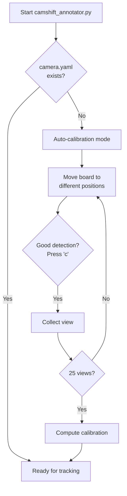
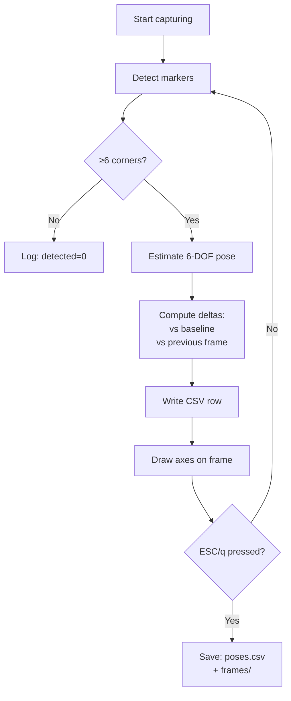

# ChAruco Board Workflow for Camera Shift Detection

Complete guide for creating ChAruco boards and detecting camera pose shifts.

## Quick Start

```bash
# 1. Generate board
python board_printer.py

# 2. Print at 100% scale, 300 DPI, mount flat on wall

# 3. Test cameras to find the right one
python test_cameras.py

# 4. Calibrate + capture (first run)
python camshift_annotator.py --source N --draw --save-frames --out session_001

# 5. Subsequent captures (uses existing camera.yaml)
python camshift_annotator.py --source N --save-frames --out session_002
```

**Output**: CSV with 6-DOF camera poses + annotated frames showing camera shifts over time.

---

## Table of Contents

1. [Preparing Printouts](#1-preparing-printouts)
2. [Physical Settings](#2-physical-settings)
3. [Camera Calibration](#3-camera-calibration)
4. [Auto Annotation (Pose Tracking)](#4-auto-annotation-pose-tracking)
5. [Understanding Output](#5-understanding-output)
6. [Troubleshooting](#troubleshooting)

---

## 1. Preparing Printouts

### Workflow



### Steps

1. **Generate**: `python board_printer.py`
   - Creates `charuco_7x5_35mm_26mm_*.png` (A4-compatible, 7×5 squares)
2. **Print**: 100% scale, 300 DPI, photo quality paper
3. **Verify**: Measure the 50mm check square - must be exactly 50mm
4. **Mount**: Glue to foam board or attach to flat wall

**Critical**: Board must be completely flat. Warping = inaccurate poses.

### Customization (Optional)

```python
from board_printer import save_charuco_png_scaled

save_charuco_png_scaled(
    path="my_board.png",
    squares_x=10, squares_y=7,    # Larger board
    square_len_m=0.040,            # 40mm squares
    marker_len_m=0.030,            # 30mm markers
    dpi=300.0
)
```

---

## 2. Physical Settings

### Workflow



### Checklist

**Physical:**
- ✓ Board flat and stable
- ✓ Camera focused on board
- ✓ Even lighting, no glare
- ✓ Board fills 30-70% of frame

**Software:**
```bash
--source N                  # Camera index (test with test_cameras.py)
--charuco-squares-x 7       # Must match printed board
--charuco-squares-y 5
--square-m 0.035            # Must match printed size (35mm = 0.035m)
--marker-m 0.026
```

**Find your camera**: Run `python test_cameras.py` to see all available cameras.

---

## 3. Camera Calibration

### Workflow



### Process

**Automatic trigger**: First run without `camera.yaml`

**Interactive steps:**
1. Window opens showing live camera + detected markers
2. Move board to different positions/angles/distances
3. Press **'c'** when green corners appear (need 15+ corners)
4. Collect 25+ views covering different areas
5. Press **'q'** when done or after 25 auto-collected

**Coverage strategy:**
```
Top-left    Top-center   Top-right     + Tilted angles
Left        Center       Right         + Near/far distances
Bottom-left Bottom       Bottom-right  + Rotated views
```

**Output**: `camera.yaml` (reusable for same camera/resolution)

---

## 4. Auto Annotation (Pose Tracking)

### Workflow



### Usage

**Basic capture:**
```bash
python camshift_annotator.py --source N --draw --save-frames
```

**Production capture (headless):**
```bash
python camshift_annotator.py --source N --save-frames --max-rate 10.0 --out data_001
```

**What's being tracked:**
- **Current pose**: Camera position (x, y, z) and orientation (roll, pitch, yaw)
- **Base delta**: Shift from first detection (total drift)
- **Previous delta**: Shift from last frame (frame-to-frame motion)

**Controls:**
- **'q'** or **ESC**: Stop and save

### Board Usage - IMPORTANT

**Use ONE board at a time:**
- ✅ Use your printed ChAruco board (same one from calibration)
- ✅ Mode: `--mode charuco` (default, no need to specify)
- ❌ Don't have multiple boards in frame - detector gets confused
- ℹ️ GridBoard (`--mode gridboard`) is an alternative if you print one separately

**Rule**: Only the board you calibrated with should be visible during tracking.

---

## 5. Understanding Output

### Directory Structure

```
session_001/
├── poses.csv              # Frame-by-frame pose data
└── frames/                # Annotated images (if --save-frames)
    ├── frame_000000.jpg
    └── ...
```

### CSV Format (22 columns)

| Column Group | Columns | Description |
|--------------|---------|-------------|
| **Metadata** | `frame_idx`, `timestamp_ns`, `detected` | Frame info, detection flag |
| **Current Pose** | `curr_tx_m`, `curr_ty_m`, `curr_tz_m` | Camera position (meters) |
| | `curr_roll_deg`, `curr_pitch_deg`, `curr_yaw_deg` | Camera orientation (degrees) |
| **Base Delta** | `base_tx_m`, `base_ty_m`, `base_tz_m` | Position shift from start |
| | `base_roll_deg`, `base_pitch_deg`, `base_yaw_deg` | Orientation change from start |
| **Previous Delta** | `prev_tx_m`, `prev_ty_m`, `prev_tz_m` | Position shift from last frame |
| | `prev_roll_deg`, `prev_pitch_deg`, `prev_yaw_deg` | Orientation change from last frame |
| **Quality** | `inliers_count` | Detected corners (more = better) |

### Quick Analysis

```python
import pandas as pd
import numpy as np

df = pd.read_csv("session_001/poses.csv")
valid = df[df['detected'] == 1]

# Calculate drift from baseline
valid['drift_mm'] = np.sqrt(
    valid['base_tx_m']**2 +
    valid['base_ty_m']**2 +
    valid['base_tz_m']**2
) * 1000

print(f"Max drift: {valid['drift_mm'].max():.2f} mm")
print(f"Mean drift: {valid['drift_mm'].mean():.2f} mm")
print(f"Detection rate: {len(valid)/len(df)*100:.1f}%")
```

### Coordinate System

**Board frame origin**: Top-left corner of board
- **X**: Right (→)
- **Y**: Down (↓)
- **Z**: Away from board (⊙ out of page)

---

## Troubleshooting

### Board Not Detected

**Symptoms**: `detected=0` in CSV, no green markers

**Fixes:**
1. Check lighting - even, bright, no glare
2. Verify camera focus - board should be sharp
3. Move closer - board should fill 30-70% of frame
4. Check board parameters match printed board
5. Ensure board is flat (no warping)

**Quick test**: Run with `--draw` flag and look for green markers on screen

### Poor Pose Accuracy

**Symptoms**: Jittery values, unrealistic movements

**Fixes:**
1. Recalibrate (delete `camera.yaml`, re-run)
2. Flatten board - check for warping
3. Verify 50mm check square is exactly 50mm
4. Improve lighting - reduce shadows
5. Increase detection quality (check `inliers_count` column)

### Calibration Issues

**"Not enough views"**: Need minimum 5 views (25+ recommended)

**"Few corners detected"**:
- Board partially out of frame
- Poor lighting or focus
- Move board to better position

**Wrong scale**:
- Measure 50mm check square with ruler
- Must be exactly 50mm when printed
- If wrong, adjust `--square-m` to measured value

### Camera Selection

**"Cannot open source"**: Wrong camera index

**Solution**: Run `python test_cameras.py` to find working cameras

---

## Command Reference

### Default Parameters

Most parameters have sensible defaults - only specify if different:

```bash
# These are defaults (no need to specify)
--mode charuco
--dict DICT_4X4_50
--charuco-squares-x 7
--charuco-squares-y 5
--square-m 0.035
--marker-m 0.026
--calib camera.yaml
--max-rate 20.0
--out run_out
```

### Common Commands

```bash
# Test which cameras are available
python test_cameras.py

# First run (auto-calibration + capture)
python camshift_annotator.py --source 0 --draw --save-frames

# Subsequent runs (load calibration)
python camshift_annotator.py --source 0 --save-frames --out session_002

# Custom board parameters
python camshift_annotator.py --source 0 --square-m 0.040 --marker-m 0.030

# Process video file
python camshift_annotator.py --source video.mp4 --save-frames --out analysis

# Production (headless, lower rate)
python camshift_annotator.py --source 0 --save-frames --max-rate 10.0
```

---

## References

- **OpenCV ArUco**: https://docs.opencv.org/4.x/d5/dae/tutorial_aruco_detection.html
- **ChArUco Boards**: https://docs.opencv.org/4.x/df/d4a/tutorial_charuco_detection.html
- **Camera Calibration**: https://docs.opencv.org/4.x/dc/dbb/tutorial_py_calibration.html
