# ChAruco Board Workflow for Camera Shift Detection

Complete guide for creating ChAruco boards and using them to detect camera pose shifts.

## Quick Start

**What you'll do:**
1. Generate and print a ChAruco board → `python board_printer.py`
2. Mount board flat on wall/surface → Physical setup
3. Calibrate your camera → `python camshift_annotator.py` (auto-calibration)
4. Capture with pose detection → `python camshift_annotator.py --draw --save-frames`

**What you'll get:** CSV with 6-DOF camera poses (position + orientation) and annotated frames showing camera shifts over time.

```bash
# Complete workflow in 3 commands
python board_printer.py                           # 1. Generate board
# (Print at 100% scale, 300 DPI, mount flat)      # 2. Physical setup
python camshift_annotator.py --source 0 --draw    # 3. Calibrate + capture
```

---

## Table of Contents

### Getting Started
- [Overview](#overview)
- [Tools](#tools)

### Workflow Guides (with Diagrams)
- [Use Case 1: Preparing Printouts](#use-case-1-preparing-printouts)
- [Use Case 2: Physical Settings](#use-case-2-physical-settings)
- [Use Case 3: Camera Calibration](#use-case-3-camera-calibration)
- [Use Case 4: Auto Annotation](#use-case-4-auto-annotation)

### Detailed Reference
- [Board Generation Options](#board-generation-options)
- [Capture Options Reference](#capture-options-reference)
- [Output Format Details](#output-format-details)
- [Coordinate Systems](#coordinate-systems)

### Support
- [Troubleshooting](#troubleshooting)
- [Advanced Usage](#advanced-usage)

---

## Overview

**ChAruco boards** combine chessboard precision with ArUco marker robustness for:
- Camera calibration
- Real-time 6-DOF pose estimation
- Camera shift/movement detection
- Ground truth dataset creation

### Tools

**`board_printer.py`** - Generate physically accurate board images
- `save_charuco_png_scaled()` - Create ChAruco board PNG
- `save_gridboard_png_scaled()` - Create ArUco GridBoard PNG

**`camshift_annotator.py`** - Camera calibration and pose tracking
- `run_charuco_calibration()` - Interactive camera calibration
- `estimate_pose_charuco()` - Real-time pose estimation
- Main loop - Continuous capture with pose deltas (base/prev)

---

## Use Case 1: Preparing Printouts

### Workflow Diagram


### Key Steps

1. **Generate board image**: Run `python board_printer.py` or customize parameters
2. **Print verification**: Measure 50mm check square to confirm correct scaling
3. **Critical requirements**: 100% scale, 300 DPI, no auto-fit

### Default Board Specifications

| Parameter | Default | Notes |
|-----------|---------|-------|
| Board type | ChAruco | 7×5 squares |
| Square size | 35mm | `square_len_m=0.035` |
| Marker size | 26mm | `marker_len_m=0.026` |
| DPI | 300 | Print resolution |
| Dictionary | DICT_4X4_50 | 50 unique markers |
| Output | A4-compatible | ~245×175mm board area |

### Customization Example

```python
from board_printer import save_charuco_png_scaled

# Large board for A3 paper
save_charuco_png_scaled(
    path="board_a3.png",
    squares_x=10, squares_y=7,
    square_len_m=0.040,  # 40mm squares
    marker_len_m=0.030,  # 30mm markers
    dpi=300.0
)
```

---

## Use Case 2: Physical Settings

### Workflow Diagram


### Physical Setup Checklist

**Board Mounting:**
- ✓ Completely flat (no warping or bending)
- ✓ Rigidly mounted (foam board, acrylic, or wall)
- ✓ Stable (no vibration or movement)
- ✓ Clean surface (no dirt or damage to markers)

**Camera Positioning:**
- ✓ Board fully visible in frame
- ✓ Camera focused on board (sharp edges)
- ✓ Resolution set (e.g., 1920×1080)
- ✓ Camera stable (tripod or fixed mount recommended)

**Lighting Requirements:**
- ✓ Even illumination across board
- ✓ No glare on board surface
- ✓ No harsh shadows on markers
- ✓ Sufficient brightness for clear detection

**Distance Guidelines:**
- Minimum: Board fills ~30% of frame
- Optimal: Board fills ~50-70% of frame
- Maximum: All markers clearly visible

### Software Configuration

**Board parameters** (must match printed board):
```bash
--charuco-squares-x 7    # Horizontal squares
--charuco-squares-y 5    # Vertical squares
--square-m 0.035         # Physical square size (meters)
--marker-m 0.026         # Physical marker size (meters)
--dict DICT_4X4_50       # ArUco dictionary
```

**Camera source:**
```bash
--source 0               # Webcam
--source 1               # External camera
--source video.mp4       # Video file
--source rtsp://...      # Network stream
```

---

## Use Case 3: Camera Calibration

### Workflow Diagram


### Calibration Process

**Automatic trigger**: When `camera.yaml` doesn't exist and mode is `charuco`

**Interactive steps:**
1. Live camera window opens with detection overlay
2. Move board to various positions:
   - Different distances (near/far)
   - Different angles (tilted, rotated)
   - Different areas (corners, center, edges)
3. Press **'c'** when green corners appear (good detection)
4. Collect 25+ views for accurate calibration
5. Press **'q'** when done collecting

**Output**: `camera.yaml` containing:
- Camera matrix (focal length, principal point)
- Distortion coefficients (lens distortion model)
- Image dimensions (width, height)

### Calibration Tips

**View collection strategy:**
```
Top-left    Top-center   Top-right
  📸          📸           📸

Left        Center       Right
  📸          📸           📸

Bottom-left Bottom-center Bottom-right
  📸          📸           📸

+ Tilted views at different angles
+ Close-up and far views
```

**Quality indicators:**
- High inlier count (>15 ChArUco corners detected)
- Sharp, clear markers
- Even lighting across board
- Minimal motion blur

### Reusing Calibration

Once calibrated, `camera.yaml` persists for:
- ✓ Same camera
- ✓ Same resolution
- ✓ Same lens settings

Recalibrate when:
- ✗ Camera changed
- ✗ Resolution changed
- ✗ Lens adjusted (focus, zoom)
- ✗ Poor pose accuracy observed

---

## Use Case 4: Auto Annotation

### Workflow Diagram



```mermaid
graph TB
    A[Start camshift_annotator.py<br/>--source 0 --draw --save-frames] --> B[Load camera.yaml]
    B --> C[Initialize CSV:<br/>poses.csv with headers]
    C --> D[Start video capture loop<br/>at max-rate Hz]

    D --> E[Capture frame]
    E --> F[detectMarkers<br/>Find ArUco markers]
    F --> G{Markers found?}

    G -->|No| H[detected=0<br/>NaN values]
    G -->|Yes| I[refineDetectedMarkers<br/>Improve accuracy]

    I --> J[interpolateCornersCharuco<br/>Extract ChAruco corners]
    J --> K{≥6 corners?}
    K -->|No| H
    K -->|Yes| L[estimatePoseCharucoBoard<br/>Solve PnP for rvec, tvec]

    L --> M{Pose valid?}
    M -->|No| H
    M -->|Yes| N[se3_from_rvec_tvec<br/>Create 4×4 transform T]

    N --> O{First detection?}
    O -->|Yes| P[Set base_T = T<br/>Initialize baseline]
    O -->|No| Q[Continue]

    P --> Q
    Q --> R[Compute deltas:<br/>base_delta = inv base_T × T<br/>prev_delta = inv prev_T × T]

    R --> S[rodrigues_to_euler_zyx<br/>Extract roll, pitch, yaw]
    S --> T[Update prev_T = T]

    H --> U[Write CSV row:<br/>frame_idx, timestamp,<br/>curr pose, base_delta,<br/>prev_delta, inliers]
    T --> U

    U --> V{--draw flag?}
    V -->|Yes| W[drawAxis on frame<br/>Show 3D axes]
    W --> X[imshow window]
    X --> Y{ESC or 'q'?}

    V -->|No| AA{--save-frames?}
    Y -->|Yes| AB[Break loop]
    Y -->|No| AA

    AA -->|Yes| AC[imwrite frame to<br/>frames/frame_NNNNNN.jpg]
    AA -->|No| AD[Continue]
    AC --> AD

    AD --> AE{End of stream?}
    AE -->|No| D
    AE -->|Yes| AB

    AB --> AF[Close CSV<br/>Release camera<br/>Destroy windows]
    AF --> AG[Output:<br/>poses.csv<br/>frames/ directory]

    style L fill:#e1f5ff
    style N fill:#e1f5ff
    style R fill:#e1f5ff
    style S fill:#e1f5ff
    style U fill:#fff4e1
    style AG fill:#e8f5e9
```

### Auto Annotation Process

**Input:**
- Live camera feed or video file
- Calibrated camera (`camera.yaml`)
- Board parameters matching physical board

**Processing pipeline:**
1. **Detect markers** - Find ArUco markers in frame
2. **Interpolate corners** - Extract ChArUco corner points
3. **Estimate pose** - Solve PnP for 6-DOF pose (rvec, tvec)
4. **Compute deltas**:
   - Base delta: Shift from first detection
   - Previous delta: Shift from last frame
5. **Log data** - Write pose + deltas to CSV

**Output:**
- `poses.csv` - Frame-by-frame pose data (22 columns)
- `frames/` - Annotated images (if `--save-frames`)

### Real-Time Visualization

When using `--draw` flag:
- Live window shows camera feed
- Green markers: Detected ArUco markers
- Blue/red/green axes: Board coordinate frame
- Text overlay: Current yaw angle

**Controls:**
- **ESC** or **'q'**: Exit capture
- Window updates at capture rate (max 20 Hz)

### Pose Delta Interpretation

**Base delta** (`base_*` columns):
- Measures **total drift** from start
- Reference: First successful detection
- Use case: "Camera moved 5cm right since baseline"

**Previous delta** (`prev_*` columns):
- Measures **frame-to-frame motion**
- Reference: Previous frame pose
- Use case: "Sudden 2mm shift detected between frames"

### Example Commands

**Live capture with visualization:**
```bash
python camshift_annotator.py --source 0 --draw
```

**Production capture (headless, save all frames):**
```bash
python camshift_annotator.py \
    --source 0 \
    --out dataset_001 \
    --save-frames \
    --max-rate 10.0
```

**Process existing video:**
```bash
python camshift_annotator.py \
    --source recording.mp4 \
    --out analysis \
    --save-frames
```

**Custom board parameters:**
```bash
python camshift_annotator.py \
    --source 0 \
    --charuco-squares-x 10 \
    --charuco-squares-y 7 \
    --square-m 0.040 \
    --marker-m 0.030 \
    --out custom_board_session
```

---

## Board Generation Options

### ChAruco Board Parameters

```python
save_charuco_png_scaled(
    path: str,              # Output PNG filename
    squares_x: int,         # Horizontal squares (default: 7)
    squares_y: int,         # Vertical squares (default: 5)
    square_len_m: float,    # Square size in meters (default: 0.035)
    marker_len_m: float,    # Marker size in meters (default: 0.026)
    dict_name: str,         # ArUco dictionary (default: "DICT_4X4_50")
    dpi: float,             # Print resolution (default: 300.0)
    margin_mm: float,       # White border (default: 10.0)
    border_bits: int        # Marker border width (default: 1)
)
```

### GridBoard Parameters

```python
save_gridboard_png_scaled(
    path: str,              # Output PNG filename
    markers_x: int,         # Horizontal markers (default: 6)
    markers_y: int,         # Vertical markers (default: 8)
    marker_len_m: float,    # Marker size in meters (default: 0.030)
    sep_len_m: float,       # Separation between markers (default: 0.006)
    dict_name: str,         # ArUco dictionary (default: "DICT_4X4_50")
    dpi: float,             # Print resolution (default: 300.0)
    margin_mm: float,       # White border (default: 10.0)
    border_bits: int        # Marker border width (default: 1)
)
```

### ArUco Dictionaries

| Dictionary | Marker Size | Total Markers | Use Case |
|------------|-------------|---------------|----------|
| DICT_4X4_50 | 4×4 bits | 50 | Small boards, default |
| DICT_5X5_100 | 5×5 bits | 100 | Medium boards |
| DICT_6X6_250 | 6×6 bits | 250 | Large boards |
| DICT_7X7_1000 | 7×7 bits | 1000 | Very large installations |

### Board Size Examples

**A4 (210×297mm):**
- 7×5 squares @ 35mm = 245×175mm ✓
- 8×6 squares @ 30mm = 240×180mm ✓

**A3 (297×420mm):**
- 10×7 squares @ 40mm = 400×280mm ✓
- 12×8 squares @ 35mm = 420×280mm ✓

**Letter (216×279mm):**
- 7×5 squares @ 35mm = 245×175mm ✓

---

## Capture Options Reference

### Command-Line Arguments

**Source:**
```bash
--source 0              # Webcam index (0, 1, 2, ...)
--source video.mp4      # Video file
--source rtsp://url     # Network stream
```

**Mode:**
```bash
--mode charuco          # ChAruco board (default)
--mode gridboard        # ArUco GridBoard only
```

**Board Configuration (ChAruco):**
```bash
--charuco-squares-x 7   # Horizontal squares
--charuco-squares-y 5   # Vertical squares
--square-m 0.035        # Square size (meters)
--marker-m 0.026        # Marker size (meters)
--dict DICT_4X4_50      # ArUco dictionary
```

**Board Configuration (GridBoard):**
```bash
--grid-markers-x 5      # Horizontal markers
--grid-markers-y 7      # Vertical markers
--marker-m 0.030        # Marker size (meters)
--grid-sep-m 0.006      # Marker separation (meters)
--dict DICT_4X4_50      # ArUco dictionary
```

**Calibration:**
```bash
--calib camera.yaml     # Calibration file path (default)
```

**Capture Control:**
```bash
--max-rate 20.0         # Max capture rate Hz (≤20)
--save-frames           # Save annotated frames
--frame-ext jpg         # Frame format (jpg/png)
--draw                  # Show live window
```

**Output:**
```bash
--out run_out           # Output directory
--board-png             # Export board PNG to output
```

---

## Output Format Details

### Directory Structure

```
run_out/
├── poses.csv              # Pose data (all frames)
├── frames/                # Annotated images (if --save-frames)
│   ├── frame_000000.jpg
│   ├── frame_000001.jpg
│   └── ...
└── charuco_board.png      # Board reference (if --board-png)
```

### CSV Columns (22 total)

| Column | Type | Description | Units |
|--------|------|-------------|-------|
| `frame_idx` | int | Frame sequence number | - |
| `timestamp_ns` | int | Capture timestamp | nanoseconds |
| `detected` | int | Board detected flag | 0/1 |
| **Current Pose** | | | |
| `curr_tx_m` | float | Camera X position | meters |
| `curr_ty_m` | float | Camera Y position | meters |
| `curr_tz_m` | float | Camera Z position | meters |
| `curr_roll_deg` | float | Camera roll angle | degrees |
| `curr_pitch_deg` | float | Camera pitch angle | degrees |
| `curr_yaw_deg` | float | Camera yaw angle | degrees |
| **Base Delta** | | | |
| `base_tx_m` | float | X shift from baseline | meters |
| `base_ty_m` | float | Y shift from baseline | meters |
| `base_tz_m` | float | Z shift from baseline | meters |
| `base_roll_deg` | float | Roll change from baseline | degrees |
| `base_pitch_deg` | float | Pitch change from baseline | degrees |
| `base_yaw_deg` | float | Yaw change from baseline | degrees |
| **Previous Delta** | | | |
| `prev_tx_m` | float | X shift from prev frame | meters |
| `prev_ty_m` | float | Y shift from prev frame | meters |
| `prev_tz_m` | float | Z shift from prev frame | meters |
| `prev_roll_deg` | float | Roll change from prev | degrees |
| `prev_pitch_deg` | float | Pitch change from prev | degrees |
| `prev_yaw_deg` | float | Yaw change from prev | degrees |
| **Quality** | | | |
| `inliers_count` | int | Detected corners/markers | - |

### Data Analysis Example

```python
import pandas as pd
import numpy as np

df = pd.read_csv("run_out/poses.csv")

# Filter successful detections
valid = df[df['detected'] == 1]

# Calculate total shift magnitude from baseline
valid['shift_mag_m'] = np.sqrt(
    valid['base_tx_m']**2 +
    valid['base_ty_m']**2 +
    valid['base_tz_m']**2
)

# Find significant shifts (>1cm)
shifts = valid[valid['shift_mag_m'] > 0.01]
print(f"Frames with >1cm shift: {len(shifts)}")

# Detect sudden movements (>5mm between frames)
valid['motion_m'] = np.sqrt(
    valid['prev_tx_m']**2 +
    valid['prev_ty_m']**2 +
    valid['prev_tz_m']**2
)
sudden = valid[valid['motion_m'] > 0.005]
print(f"Sudden movements detected: {len(sudden)}")

# Plot shift over time
import matplotlib.pyplot as plt
plt.plot(valid['frame_idx'], valid['shift_mag_m'] * 1000)
plt.xlabel('Frame')
plt.ylabel('Camera Shift (mm)')
plt.title('Camera Drift from Baseline')
plt.show()
```

---

## Coordinate Systems

### Board Coordinate Frame

**Origin**: Top-left corner of board
**Axes**:
- **X**: Right (→) along horizontal edge
- **Y**: Down (↓) along vertical edge
- **Z**: Away from board (⊙) into scene

```
Board (top view):
   Y
   ↓
   ┌─────────┐
   │ ■ □ ■ □ │
   │ □ ■ □ ■ │ → X
   │ ■ □ ■ □ │
   └─────────┘

   Z points out of page (⊙)
```

### Camera Pose

**Position** (tx, ty, tz):
- Camera center in board coordinates
- Units: meters

**Orientation** (roll, pitch, yaw):
- ZYX Euler angles (Tait-Bryan)
- Roll: Rotation around X-axis
- Pitch: Rotation around Y-axis
- Yaw: Rotation around Z-axis
- Units: degrees

### Transform Relationships

**Current pose**: `T_board_camera` (board → camera transform)

**Base delta**: `T_base_current = inv(T_base) × T_current`
- How much camera moved since first detection

**Previous delta**: `T_prev_current = inv(T_prev) × T_current`
- How much camera moved since last frame

---

## Troubleshooting

### Board Not Detected

**Symptom**: `detected=0` in CSV, no visualization

**Checks**:
1. ✓ Board parameters match (`--square-m`, `--marker-m`)
2. ✓ Lighting: even, bright, no glare
3. ✓ Focus: camera focused on board
4. ✓ Print quality: sharp markers, correct scale
5. ✓ Distance: board fully in frame
6. ✓ Dictionary: matches board (`--dict`)

**Quick test**:
```bash
python camshift_annotator.py --source 0 --draw
# Should see green markers if detected
```

### Poor Pose Accuracy

**Symptom**: Jittery values, unrealistic shifts

**Solutions**:
1. Recalibrate camera (delete `camera.yaml`, re-run)
2. Flatten board (check for warping)
3. Verify physical dimensions (measure 50mm square)
4. Increase `inliers_count` (improve lighting, closer distance)
5. Stable mount (eliminate vibration)

### Calibration Fails

**Symptom**: "Not enough views" or "Calibration failed"

**Solutions**:
1. Collect 25+ views (not just 5 minimum)
2. Vary angles (tilted, rotated, not just straight-on)
3. Cover entire frame (corners, edges, center)
4. Check detection (green corners visible before pressing 'c')
5. Improve lighting (sharp, clear images)

### Wrong Physical Scale

**Symptom**: Distances don't match reality

**Diagnosis**:
1. Measure printed 50mm check square with ruler
2. If ≠ 50mm: Print scaling is wrong
3. Check printer settings: 100% scale, 300 DPI

**Fix**:
```bash
# Option 1: Reprint correctly
# Option 2: Adjust square_len_m to measured value
python camshift_annotator.py --square-m 0.0347  # If measured 34.7mm
```

### High CPU Usage

**Symptom**: Dropped frames, system slowdown

**Solutions**:
```bash
# Reduce capture rate
--max-rate 10.0

# Disable visualization
# (remove --draw)

# Disable frame saving
# (remove --save-frames)

# Lower camera resolution in camera settings
```

### Common Error Messages

**"Cannot open source"**
- Check camera index: try `--source 1` or `--source 2`
- Check video path: ensure file exists
- Check camera permissions

**"Calibration file not found"**
- Normal on first run (auto-calibrates)
- For GridBoard: must provide existing calibration

**"Not enough views for calibration"**
- Collect at least 5 views (25+ recommended)
- Press 'c' when green corners visible

---

## Advanced Usage

### GridBoard Instead of ChAruco

GridBoards use only ArUco markers:

```bash
python camshift_annotator.py \
    --mode gridboard \
    --grid-markers-x 5 \
    --grid-markers-y 7 \
    --marker-m 0.030 \
    --grid-sep-m 0.006 \
    --calib camera.yaml  # Required (no auto-calibration)
```

**ChAruco vs GridBoard:**
- ChAruco: More accurate, auto-calibration, needs clear corners
- GridBoard: Simpler, robust to partial occlusion, requires pre-calibration

### Custom Board Sizes

```python
from board_printer import save_charuco_png_scaled

# Large outdoor board (A3 size)
save_charuco_png_scaled(
    path="board_outdoor.png",
    squares_x=10, squares_y=7,
    square_len_m=0.050,   # 50mm squares
    marker_len_m=0.037,   # 37mm markers
    dpi=300.0
)

# High-density close-range board
save_charuco_png_scaled(
    path="board_closeup.png",
    squares_x=12, squares_y=9,
    square_len_m=0.020,   # 20mm squares
    marker_len_m=0.015,   # 15mm markers
    dpi=600.0             # Higher DPI for small features
)
```

### Batch Processing Videos

```bash
#!/bin/bash
for video in *.mp4; do
    python camshift_annotator.py \
        --source "$video" \
        --out "analysis_${video%.mp4}" \
        --save-frames
done
```

### Integration with Analysis Pipeline

```python
# Load pose data
import pandas as pd
poses = pd.read_csv("run_out/poses.csv")

# Detect camera shift events
shifts = poses[poses['detected'] == 1]
shifts['shift_mag'] = (
    shifts['base_tx_m']**2 +
    shifts['base_ty_m']**2 +
    shifts['base_tz_m']**2
)**0.5

# Flag frames with significant shift
threshold_m = 0.01  # 1cm
shift_frames = shifts[shifts['shift_mag'] > threshold_m]['frame_idx'].tolist()

# Process corresponding images
for idx in shift_frames:
    img_path = f"run_out/frames/frame_{idx:06d}.jpg"
    # ... your processing code ...
```

---

## References

**OpenCV ArUco Module:**
- ArUco detection: https://docs.opencv.org/4.x/d5/dae/tutorial_aruco_detection.html
- ChArUco boards: https://docs.opencv.org/4.x/df/d4a/tutorial_charuco_detection.html
- Dictionary reference: https://docs.opencv.org/4.x/d9/d6a/group__aruco.html

**Camera Calibration:**
- Calibration tutorial: https://docs.opencv.org/4.x/dc/dbb/tutorial_py_calibration.html
- PnP pose estimation: https://docs.opencv.org/4.x/d5/d1f/calib3d_solvePnP.html

---

## Quick Reference Card

```bash
# 1. Generate board
python board_printer.py

# 2. Print at 100% scale, 300 DPI, verify 50mm square

# 3. First run (auto-calibration)
python camshift_annotator.py --source 0 --draw --save-frames --out run_001

# 4. Subsequent runs
python camshift_annotator.py --source 0 --save-frames --out run_002

# Custom board parameters
python camshift_annotator.py \
    --charuco-squares-x 10 \
    --charuco-squares-y 7 \
    --square-m 0.040 \
    --marker-m 0.030

# Process video file
python camshift_annotator.py --source video.mp4 --out analysis

# GridBoard mode
python camshift_annotator.py --mode gridboard --calib camera.yaml
```

**Default parameters** (omit if using these):
- `--mode charuco`
- `--dict DICT_4X4_50`
- `--charuco-squares-x 7`
- `--charuco-squares-y 5`
- `--square-m 0.035`
- `--marker-m 0.026`
- `--calib camera.yaml`
- `--max-rate 20.0`
- `--out run_out`
